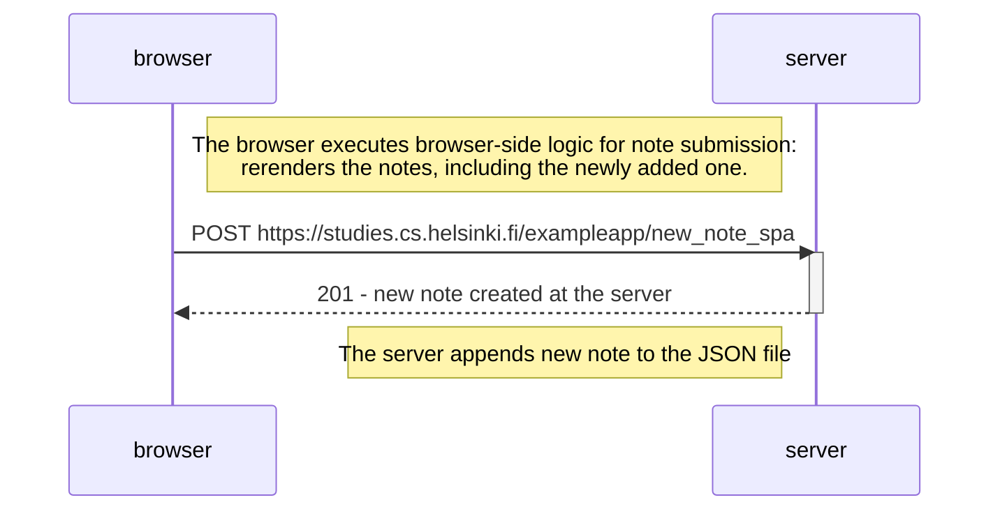

```mermaid
sequenceDiagram
    participant browser
    participant server

    Note right of browser: The browser executes browser-side logic for note submission: <br/>rerenders the notes, including the newly added one. 

    browser->>server: POST https://studies.cs.helsinki.fi/exampleapp/new_note_spa
    activate server
    server-->>browser: 201 - new note created at the server
    deactivate server

    Note left of server: The server appends new note to the JSON file
```
